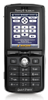

# Winamp Remote Control for Sony Ericsson mobiles

> *This project is not maintained since 2007, it is
strictly a source archive to preserve legacy software an functionality.*

## Introduction
This repo is a project archive for Winamp Remote Control
application on legacy Sony Ericsson mobiles. It enables you
handheld to fully control your computer and namely Winamp
via Bluetooth HID protocol when Global Hotkey support is enabled
on your Media Player.

## Requirements
 - Nullsoft Scriptable Install System - https://sourceforge.net/projects/nsis/ 
 - Bluetooth HID Capable Sony Ericsson mobile
 - For Development - [SE Bluetooth Remote Control](https://web.archive.org/web/20050813003510/http://developer.sonyericsson.com/site/global/docstools/misc/p_misc.jsp) 

## Files and Folders
- `setup` - Latest NSI projectfor the setup.exe
- `src` - Bluetooth HID configuration files and image assets for SE image assets
    - Small res - [`./src/hid/A/Winamp GHRC.hid`](./src/hid/A/)
    - Medium res -  [`./src/hid/B/Winamp GHRC.hid`](./src/hid/B/)
    - High res -  [`./src/hid/C/Winamp GHRC.hid`](./src/hid/C/)

For compiled binaries, please check the assets under
[Github releases](https://github.com/murati-hu/WinampSERemoteControl/releases).

## Docs
Read more about the usage and instructions from my the original
blog announcement under
[`docs/README.md`](./docs/README.md) from 2006 in Hungarian.

