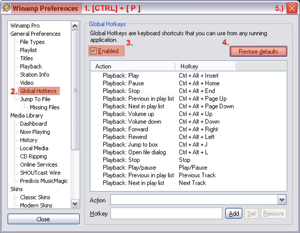
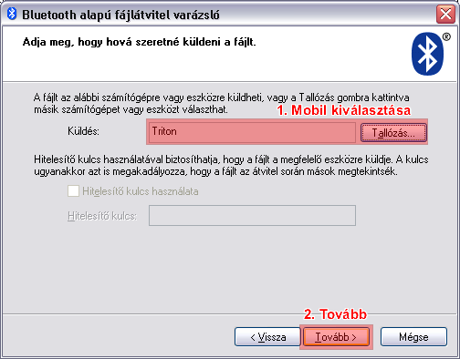

### Winamp távírányító Sony-Ericsson Mobiltelefonnal

Nem csalás, nem ámítás! Igen, lehetséges szeretett Winampunk távirányítása
bluetooth képes Sony-Ericsson mobiltelefonunkal!

Próbáld ki ezt az általam készített kis csomagot, töltsd fel mobilodra
és vezéreld a Lámát akár a konyhából is!

Kevés olyan ember van, aki valóban kihasználja mobiltelefonjai képességeit..
Szeretek nem közéjük tartozni. Ha már amúgy is meg kell venni a méregdrága
csilivilli kütyüt, akkor legalább tudjuk, hogy mit is tudunk vele kezdeni.

A Sony-Ericssonok egyik fél-rejtett képessége Bluetooth HID, azaz a távvezérlő.
Ennek segítségével, ha egyszer rendesen párosítjuk SE mobilunkat számítógépünkkel,
akkor a gép képes őt egy billentyűzetként vagy egy egérként is használni.

Az általam készített Winamp távirányító annyiban jobb a többihez képest,
hogy a Winamp, Global-Hotkey funkcióját használja ki. Ellentétben más
csomagokkal, ezáltal nem kell winamp ablakának aktívan lennie, elég ha
csak a háttérben fut, úgy is irányíthatjuk.

A távirányító kompatibilitási okok miatt csak az alap winamp Global-Hotkey
parancsokat használja, ezáltal segítségével Lejátszhatunk, tekerhetünk,
ugorhatunk előre/hátra, szüneteltethetünk, leállíthatunk, hangerőt
szabályozhatunk, miközben a telefon joystickja és a funckiógombok
egérként funkcionálnak.

Jelenleg 2 változatban készült el a csomag (128x160 és 176x220 pixel felbontásban),
de hamarosan elkészül a nagyfelbontású (240x320-as) változat is az újabb
generációs SE mobilokhoz. Ezáltal az alábbi mobiltelefonokon tudod
használni kis a programot (beleértve az 'i' típusokat is):
 - `128x160`: W300, K510, Z530, Z520, Z525
 - `176x220`: Z550, K600, W600, K610, Z610, K618, K700, W700, K750, W810
 - `240x320`: S700, K790, K800, W850, W900

Fontos! Ne felejtsük el engedélyezni a Winamp Global Hotkey funkcióját a
Tulajdonságok között, és ezeket csak az alapértelmezett parancsokkal használjuk!

## Hogyan
A beállításhoz indítsuk el a Winampot,
 1) CTRL+P billentyűkombinációval nyissuk meg a Tulajdonságok ablakot,
 majd a bal oldali menüben keressük ki a
 2) Global Hotkeys opciót, ahol engedélyezzük azt az
 3) Enabled jelölővel, majd a biztonság kedvéért kattintsunk a
 4) Restore defaults gombra.
 5) Végül bezárhatjuk ablakunkat és távirányítónk máris működőképes.

 

Amennyiben a telepítővel valamilyen oknál fogva nem tudtuk átküldeni a távirányítót, abban az esetben, próbáljuk meg kézzel átküldeni mobilunkraÉ
 1) Kattintsuk a Start Menü/Minden Program menüpontjára, ott keressük ki a Winamp távirányító mappáját, majd
 2) Jobb klikkel a `Winamp GHRC.hid` fájlra kattintva
 3) válasszuk a Küldés menün belül a BlueTooth-eszköz pontot.
 4) Eztán a varázsló segítségével küldjük át programunkat moblunkra.

 

A Mobiltelefonon a telepített alkalmazást vagy a **Szórakozás** vagy a **Bluetooth** menüpont alatt találjuk meg a távvezérlő elindításával.